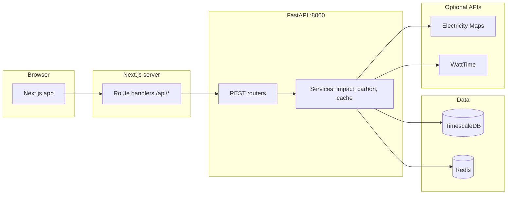
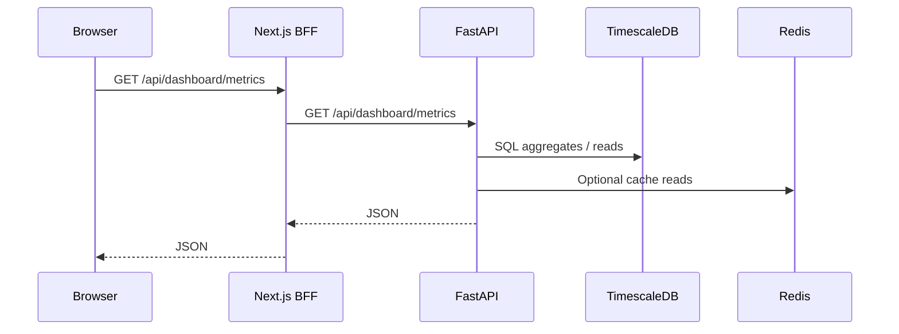

# Eco Impact Dashboard

One codebase (a **monorepo**) for a web app that tracks how **AI workloads** affect **energy use**, **CO₂ from the power grid**, **water use**, and lets you **compare models**. The front end is **Next.js 15**. The back end is **FastAPI** with **PostgreSQL (TimescaleDB)** and **Redis**.

---

## What it does

The app shows how much **electricity**, **CO₂** (based on the grid mix), and **water** are involved when you run AI **inference**, not only which model answers faster. Numbers use **grid data** (live or sample), plus simple **building efficiency** settings where we have them (things like **PUE** and **WUE** for data centers).

In one interface you can see **summary numbers**, **energy trends**, **carbon by region**, **water and sustainability views**, **model comparison**, and a **map** of sites with **grid carbon** and a simple **water stress** view.

## Why it is useful

- **Awareness.** Turns vague ideas like “AI uses a lot of power” into **figures** you can line up side by side: power per request, carbon for a given region, rough water impact.
- **Choice.** Compare **models** and **regions** so you can ask where and when jobs run, not only which API you call.
- **Transparency.** Explains **how numbers are built** and links them to **model catalog values**, **grid readings**, and **public style sustainability data** when you turn those sources on, so both technical and non technical people can talk about tradeoffs.
- **Learning.** Good for a **portfolio** or **course project**: current **Next.js**, **FastAPI**, and **TimescaleDB**, optional **Electricity Maps** and **WattTime**, and **seed data** so graphs work on day one.

These numbers are **guides for comparison**, not official carbon reports. They depend on your data and settings. Use an expert process if you need audit or compliance level reporting.

## Features

| Area | What you get |
|------|----------------|
| **Dashboard (home)** | Summary **stats** (energy, average grid carbon, water, query count), small **trend charts**, **energy by company** over time, **carbon by region** bars, **model ranking** table. |
| **Energy** | **Charts over time** by provider, **training vs inference** rough split, **GPU power** reference bars, **energy per query** from the catalog. |
| **Carbon** | **Map** of regional intensity, **history lines** by region, **best hours (UTC)** with lower average intensity in the range, **emissions scope** style charts from **sustainability** inputs. |
| **Water** | **Water use** bars by provider, **calculator** (queries times model times region), **map** of sites with stress styling. |
| **Compare models** | Pick several catalog models, **radar** chart, **savings** hint (kWh, water, CO₂) from the impact API, **detail table**. |
| **Map** | **Leaflet** with **OpenStreetMap**: data centers, optional **carbon** and **water stress** layers. |
| **Backend** | **Impact** endpoints (single estimate and compare), **dashboard** math, **carbon** helpers, **catalog** (data centers, sustainability reports, GPU list), **Alembic** migrations, **seed** script, optional **Electricity Maps** loader. |
| **Resilience** | If the API fails, the web app can still show **sample chart data** so the UI does not go blank. |

---

## Architecture

### System overview



### Request path (typical dashboard load)



### Repository layout

| Path | Role |
|------|------|
| `apps/web` | Next.js 15 (App Router), React 19, Tailwind 4, shadcn/ui, Recharts / ECharts / Leaflet |
| `apps/api` | FastAPI, SQLAlchemy 2 async, Alembic, Pydantic v2, httpx, optional Prefect flows |
| `packages/shared-types` | Shared TypeScript types (`workspace:^` from web) |

---

## Tech stack

| Layer | Technologies |
|-------|----------------|
| Frontend | Next.js 15, React 19, TypeScript 5, TanStack Query, Tailwind CSS 4 |
| Backend | Python 3.12+, FastAPI, Uvicorn, SQLAlchemy, asyncpg |
| Data | TimescaleDB (hypertables: `carbon_intensity_readings`, `energy_estimates`), Redis |
| Tooling | Turborepo, pnpm 9+, Alembic |

---

## Prerequisites

- **Node.js** 20+
- **pnpm** 9+ (`corepack enable pnpm`)
- **Python** 3.12+
- **Docker** + Docker Compose (local DB + Redis)

---

## Quick start

### 1. Install dependencies

```bash
git clone https://github.com/deeptiagrawal19/eco_impact.git eco-impact-dashboard
cd eco-impact-dashboard
pnpm install
```

### 2. Infrastructure

```bash
docker compose up -d
```

- **TimescaleDB** → `localhost:5432`, database `eco_dashboard`, user `postgres`, password `dev_password` (see `docker-compose.yml`)
- **Redis** → `localhost:6379`

### 3. Environment

Copy [.env.example](.env.example) to `.env` at the repo root. For FastAPI, mirror the same variables in `apps/api/.env` (or symlink). For Next server routes, set at least:

- `API_URL=http://localhost:8000`
- `NEXT_PUBLIC_API_URL=http://localhost:8000` (if you use it in server config)

Never commit real `.env` files (they are gitignored).

### 4. Database migrations & seed

```bash
cd apps/api
python -m venv .venv
source .venv/bin/activate   # Windows: .venv\Scripts\activate
pip install -e .
pip install -e ".[dev]"     # optional: Ruff for linting
alembic upgrade head
python seed.py
python fetch_initial_data.py   # optional: needs Electricity Maps API key
```

### 5. Run development servers

From the **monorepo root**:

```bash
pnpm dev
```

- **Web:** http://localhost:3000  
- **API:** http://localhost:8000 (health: http://localhost:8000/health)

`pnpm dev` runs Turbo `dev` tasks: shared-types watch, API (Uvicorn), and Next dev.

**Alternative:** automated bootstrap (Docker + migrate + seed + optional fetch):

```bash
chmod +x setup.sh
./setup.sh
```

---

## npm / pnpm scripts

| Command | Description |
|---------|-------------|
| `pnpm dev` | Turbo: web + api + shared-types in watch mode |
| `pnpm build` | Production build (Next + shared types) |
| `pnpm lint` | Lint across packages |

`apps/api/package.json` also defines `db:upgrade`, `db:seed`, etc.

---

## API surface (high level)

- **`/api/dashboard/*`:** metrics, energy timeline, carbon by region and history, training or inference split, best times
- **`/api/impact/*`:** one model estimate, compare models, catalog
- **`/api/carbon/*`:** carbon helpers and regions
- **`/api/datacenters`**, **`/api/sustainability/reports`**, **`/api/gpu/benchmarks`:** catalog data
- **`/health`:** simple health check

CORS defaults target `http://localhost:3000` (`apps/api/app/core/config.py`).

---

## Troubleshooting

| Issue | What to check |
|------|----------------|
| API **connection refused** to Postgres | `docker compose ps`; use `localhost` in `DATABASE_URL` when the API runs on the host (not the Docker service name `postgres`). |
| **pnpm** workspace errors | Run `pnpm install` from the **repo root**, not only `apps/web`. |
| **Nested `.git` in `apps/web`** | Remove it if you want a single repository at the monorepo root. |
| Next **lockfile / turbopack root** | `apps/web/next.config.ts` may set `turbopack.root` to the monorepo root. |

---

## Contributing

Issues and PRs are welcome. Keep API and web changes aligned with shared types in `packages/shared-types` when you touch request/response shapes.
