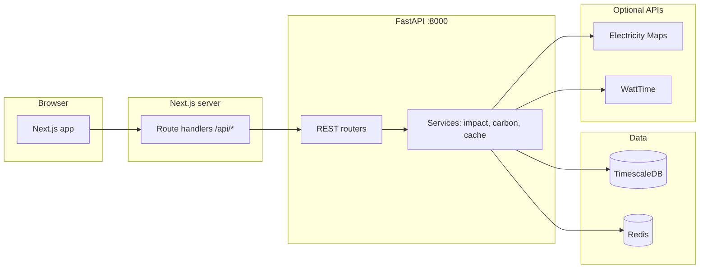
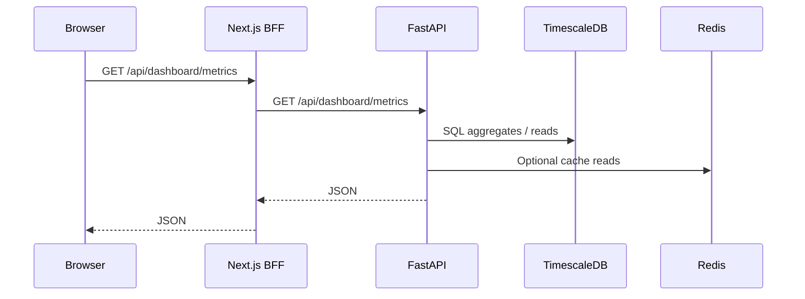

# Eco Impact Dashboard

Monorepo for a full-stack **environmental impact dashboard** focused on AI workloads: **energy**, **grid CO₂**, **water**, and **model comparisons**. The UI is **Next.js 15**; the API is **FastAPI** with **PostgreSQL / TimescaleDB** and **Redis**.

---

## What it does

This project helps you **explore and compare the environmental footprint of AI inference**—not just which model is “faster,” but roughly **how much electricity**, **grid-dependent CO₂**, and **water** different workloads and models imply when paired with **real or seeded grid data** and **facility assumptions** (PUE, WUE, data-center metadata).

You get a **single place** to see high-level metrics, drill into **energy over time**, **carbon by region**, **water and sustainability context**, **side‑by‑side model comparison**, and a **map** of facilities versus grid and stress proxies.

## Why it’s useful

- **Awareness** — Makes abstract “AI is compute-heavy” concrete with **numbers you can compare** (energy per query, regional grid carbon, orders-of-magnitude water).
- **Choice** — Supports **comparing models and regions** so teams can think about **where and when** they run workloads, not only which endpoint they call.
- **Transparency** — Surfaces **methodology notes** and ties numbers to **catalog baselines**, **grid readings**, and **public sustainability-style report data** (where configured)—so trade-offs are easier to discuss with engineering and non-engineering stakeholders.
- **Learning & demos** — Works as a **portfolio or teaching** codebase: modern **Next.js + FastAPI + TimescaleDB** stack, optional **Electricity Maps** / **WattTime** hooks, and **seed data** so charts aren’t empty on first run.

*Estimates are illustrative and depend on data quality and assumptions; use them for insight and relative comparison, not compliance-grade carbon accounting without review.*

## Features

| Area | What you get |
|------|----------------|
| **Dashboard (home)** | Roll-up **metrics** (energy, average grid carbon, water, query volume), **sparklines**, **energy by provider** over a selectable window, **carbon by region** bars, **model efficiency** table. |
| **Energy** | Provider **timelines**, **training vs inference** split (heuristic), **GPU TDP** reference bars, **energy per query** from the model catalog. |
| **Carbon** | **World-style map** of regional intensity, **historical lines** by region, **best UTC hours** (lowest average intensity in the window), **scope-style emissions** charts from **sustainability report** data. |
| **Water** | **Reported water** bars by provider, **usage calculator** (queries × model × region), **stress vs data-center sites** map. |
| **Compare models** | Multi-select catalog models, **radar** profile, **switch savings** estimate (kWh, water, CO₂) from the impact API, **detailed metrics** table. |
| **Map** | **Leaflet + OpenStreetMap**: data centers, optional **carbon** / **water stress** overlays. |
| **Backend** | **Impact API** (estimate & compare), **dashboard aggregates**, **carbon** routes, **catalog** (datacenters, sustainability reports, GPU benchmarks), **Alembic** migrations, **seed script** and optional **Electricity Maps** ingestion script. |
| **Resilience** | **Offline-style fallbacks** in the web app when the API errors so the UI still shows **meaningful chart data** for demos. |

---

## Architecture

### System overview



### Request path (typical dashboard load)



### Repository layout

| Path | Role |
|------|------|
| `apps/web` | Next.js 15 (App Router), React 19, Tailwind 4, shadcn/ui, Recharts / ECharts / Leaflet |
| `apps/api` | FastAPI, SQLAlchemy 2 async, Alembic, Pydantic v2, httpx, optional Prefect flows |
| `packages/shared-types` | Shared TypeScript types (`workspace:^` from web) |

---

## Tech stack

| Layer | Technologies |
|-------|----------------|
| Frontend | Next.js 15, React 19, TypeScript 5, TanStack Query, Tailwind CSS 4 |
| Backend | Python 3.12+, FastAPI, Uvicorn, SQLAlchemy, asyncpg |
| Data | TimescaleDB (hypertables: `carbon_intensity_readings`, `energy_estimates`), Redis |
| Tooling | Turborepo, pnpm 9+, Alembic |

---

## Prerequisites

- **Node.js** 20+
- **pnpm** 9+ (`corepack enable pnpm`)
- **Python** 3.12+
- **Docker** + Docker Compose (local DB + Redis)

---

## Quick start

### 1. Install dependencies

```bash
git clone https://github.com/deeptiagrawal19/eco_impact.git eco-impact-dashboard
cd eco-impact-dashboard
pnpm install
```

### 2. Infrastructure

```bash
docker compose up -d
```

- **TimescaleDB** → `localhost:5432`, database `eco_dashboard`, user `postgres`, password `dev_password` (see `docker-compose.yml`)
- **Redis** → `localhost:6379`

### 3. Environment

Copy [.env.example](.env.example) to `.env` at the repo root. For FastAPI, mirror the same variables in `apps/api/.env` (or symlink). For Next server routes, set at least:

- `API_URL=http://localhost:8000`
- `NEXT_PUBLIC_API_URL=http://localhost:8000` (if you use it in server config)

Never commit real `.env` files (they are gitignored).

### 4. Database migrations & seed

```bash
cd apps/api
python -m venv .venv
source .venv/bin/activate   # Windows: .venv\Scripts\activate
pip install -e .
pip install -e ".[dev]"     # optional: Ruff for linting
alembic upgrade head
python seed.py
python fetch_initial_data.py   # optional: needs Electricity Maps API key
```

### 5. Run development servers

From the **monorepo root**:

```bash
pnpm dev
```

- **Web:** http://localhost:3000  
- **API:** http://localhost:8000 — health: http://localhost:8000/health  

`pnpm dev` runs Turbo `dev` tasks: shared-types watch, API (Uvicorn), and Next dev.

**Alternative:** automated bootstrap (Docker + migrate + seed + optional fetch):

```bash
chmod +x setup.sh
./setup.sh
```

---

## npm / pnpm scripts

| Command | Description |
|---------|-------------|
| `pnpm dev` | Turbo: web + api + shared-types in watch mode |
| `pnpm build` | Production build (Next + shared types) |
| `pnpm lint` | Lint across packages |

`apps/api/package.json` also defines `db:upgrade`, `db:seed`, etc.

---

## API surface (high level)

- **`/api/dashboard/*`** — Metrics, energy timeline, carbon by region/history, training/split heuristics, best times
- **`/api/impact/*`** — Per-model estimates, comparison, catalog
- **`/api/carbon/*`** — Carbon helpers / regions
- **`/api/datacenters`**, **`/api/sustainability/reports`**, **`/api/gpu/benchmarks`** — Catalog data
- **`/health`** — Liveness

CORS defaults target `http://localhost:3000` (`apps/api/app/core/config.py`).

---

## Troubleshooting

| Issue | What to check |
|------|----------------|
| API **connection refused** to Postgres | `docker compose ps`; use `localhost` in `DATABASE_URL` when the API runs on the host (not the Docker service name `postgres`). |
| **pnpm** workspace errors | Run `pnpm install` from the **repo root**, not only `apps/web`. |
| **Nested `.git` in `apps/web`** | Remove it if you want a single repository at the monorepo root. |
| Next **lockfile / turbopack root** | `apps/web/next.config.ts` may set `turbopack.root` to the monorepo root. |

---

## Before pushing to GitHub

- Confirm **no secrets** in the repo (only `.env.example` with empty or dummy values).
- Add a **LICENSE** if the project is public.
- Run `pnpm build` and smoke-test `pnpm dev` locally.

---

## Contributing

Issues and PRs are welcome. Keep API and web changes aligned with shared types in `packages/shared-types` when you touch request/response shapes.
